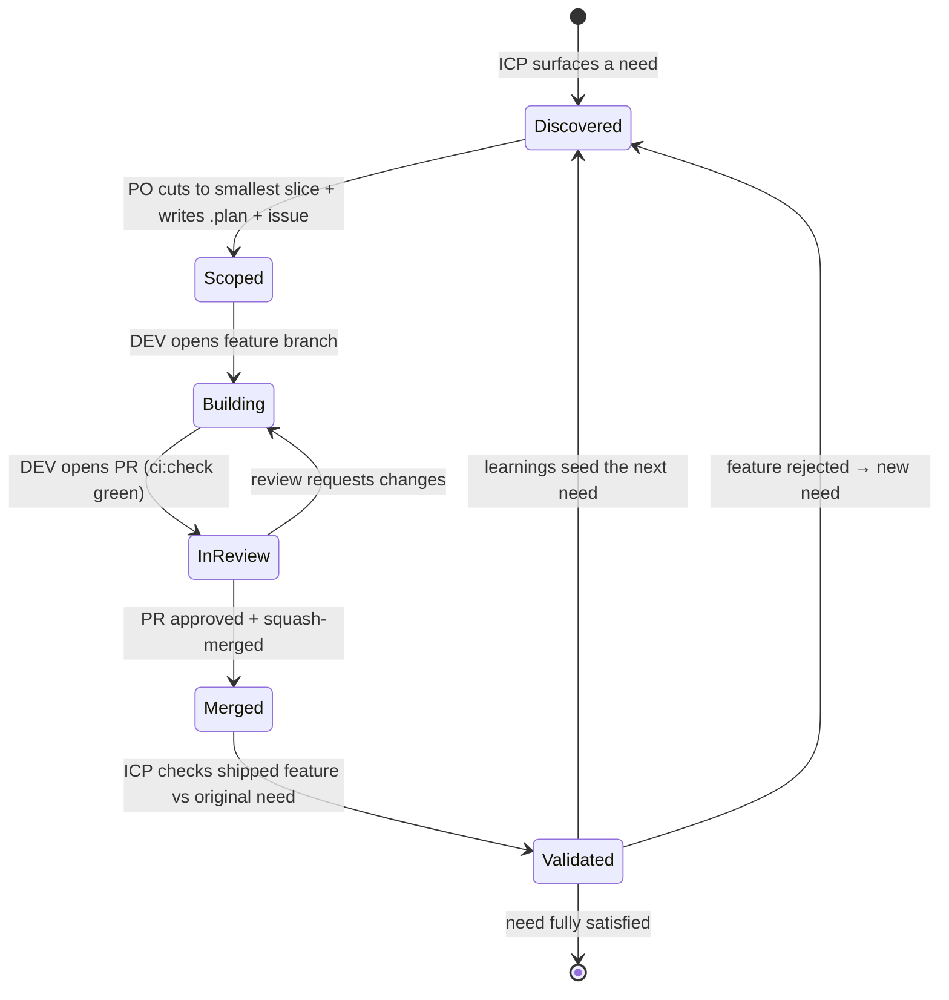

# Agent Loop Orchestration

This file defines **how the three agents collaborate** to ship one feature at a time. It is
the operational contract for the loop introduced in
[`copilot-instructions.md`](copilot-instructions.md). Read that first for product and
principles.

## Roles

| Agent | File | Owns | Produces |
| --- | --- | --- | --- |
| ICP | [`agents/icp.md`](agents/icp.md) | The user's reality: needs, pain, validation | User stories + acceptance criteria; feature verdicts |
| Product Owner | [`agents/product-owner.md`](agents/product-owner.md) | Scope & priority (YAGNI) | `.plan/<NNNN>-<slug>.md` + a GitHub issue |
| Product Developer | [`agents/product-developer.md`](agents/product-developer.md) | Implementation (SOLID/KISS) | Feature branch, Pest tests, PR that closes the issue |

## The loop as a state machine

Each feature moves through these states. Only **one** feature should be in an
implementation state (`Scoped` → `Merged`) at a time — we ship serially.

## Handoff contracts

A handoff is only valid when the **entry criteria** of the receiving stage are met. If they
are not, the work bounces back with a comment on the issue.

### ICP → Product Owner (a Need)

Entry criteria for the PO to accept:

- A named ICP persona (from [`agents/icp.md`](agents/icp.md)) with the job-to-be-done.
- The pain in the user's own words, and why it matters now.
- At least one user story: `As a <persona>, I want <capability>, so that <outcome>`.
- Draft acceptance criteria phrased from the user's point of view.

### Product Owner → Product Developer (a Spec)

Entry criteria for the Developer to start:

- A `.plan/<NNNN>-<slug>.md` created from [`.plan/_template.md`](../.plan/_template.md).
- Scope explicitly cut with a **"Deliberately out of scope (YAGNI)"** list.
- Testable, unambiguous acceptance criteria.
- A GitHub issue opened, linked to the plan, labeled, and referenced by number.

### Product Developer → ICP (a Shipped Feature)

Entry criteria for validation:

- PR merged to `main`; issue auto-closed via `Closes #<issue>`.
- `composer ci:check` green on the PR.
- The plan's acceptance criteria are all checked off in the PR description.

## Definition of Ready / Definition of Done

- **Ready** (PO → DEV): plan exists, scope cut, acceptance criteria testable, issue open.
- **Done** (DEV → ICP): see the Definition of Done in
  [`copilot-instructions.md`](copilot-instructions.md#5-definition-of-done).

## Memory protocol

After **every** stage transition, the acting agent appends one row to the ledger in
[`memory.md`](memory.md) and, when a durable decision is made (a chosen pattern, a rejected
approach, a constraint), adds a short **Decision** entry. The next agent reads `memory.md`
before acting so context compounds instead of resetting.

## One-feature-at-a-time rule

Do not let the Product Developer start a second feature while one is in `Building` or
`InReview`. Parallel features fragment review, break the serial validation loop, and tempt
speculative abstraction. Finish, merge, validate, then pull the next need.

## Escalation

If a stage cannot meet its entry criteria after one bounce-back, stop and raise it for a
human decision in the issue thread rather than guessing or expanding scope.
