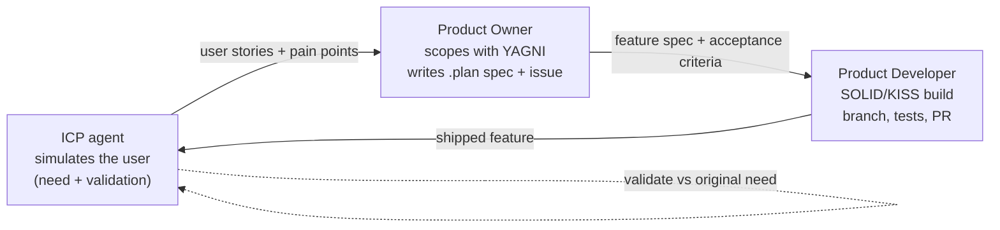

# Copilot Instructions — coldsocial

> Read this first, on every task. It is the entry point to how we build this product.
> Tech conventions live in [`AGENTS.md`](../AGENTS.md) and `.agents/skills/**`. This file
> owns **product**, **principles**, and the **agent development loop**. Do not duplicate
> tech rules here — reference them.

## 1. What we are building

**coldsocial** automates social media presence for a single person or brand. It:

- Gathers the user's current, personal information (profile, updates, milestones, links).
- Generates platform-native posts for **LinkedIn, TikTok, Instagram, YouTube, Facebook**, and other platforms.
- Publishes and schedules that content.
- Watches performance of published media — **likes, comments, shares, views, saves, reach** and other metrics — and feeds results back into future content.

**Who it is for (our ICPs):** entrepreneurs, business heads, and individuals who want to
grow on social media. See [`.github/agents/icp.md`](agents/icp.md) for the concrete profiles.

## 2. Non-negotiable engineering principles

We apply **SOLID + YAGNI + KISS at the same time**. When they appear to conflict, the
tie-break order is **KISS → YAGNI → SOLID**: prefer the simplest thing that works, don't
build what no ICP has asked for, and only reach for an abstraction once a second concrete
consumer exists.

- **SOLID**
  - _Single responsibility:_ one class/module = one reason to change. Controllers stay thin;
    business logic lives in Actions/Services; persistence in models/repositories.
  - _Open/closed:_ add a new platform (e.g. a new social network) by adding a class that
    implements the existing publisher/metrics contract — never by editing a `switch` over
    platform names.
  - _Liskov:_ every platform integration must be substitutable behind its interface.
  - _Interface segregation:_ separate `PublishesContent` from `ReportsMetrics`; a platform
    that can't report metrics must not be forced to stub them.
  - _Dependency inversion:_ depend on interfaces (contracts), resolve concretes via the
    Laravel container.
- **YAGNI** — Build only what the current feature's acceptance criteria require. No "we might
  need it" fields, endpoints, config, or platforms. Delete speculative code on sight.
- **KISS** — Prefer a boring, readable solution over a clever one. No premature abstraction,
  no config-driven indirection for a single call site, no framework-inside-the-framework.

> If you are about to add an interface, factory, event, or config flag with **one** consumer,
> stop — that is a YAGNI/KISS violation. Inline it and leave a note for when the second
> consumer appears.

## 3. The agent development loop

We develop **one feature at a time** through a three-role loop. Each role has a definition
in `.github/agents/` and hands off to the next. The loop is the source of truth for _what_ we
build; this repo's skills and `AGENTS.md` are the source of truth for _how_.

1. **ICP agent** ([`agents/icp.md`](agents/icp.md)) simulates a target user, surfaces a real
   need or reacts to a shipped feature, and writes it as user stories + acceptance criteria.
2. **Product Owner** ([`agents/product-owner.md`](agents/product-owner.md)) applies YAGNI,
   cuts the need down to the smallest valuable slice, writes a plan in `.plan/`, and opens a
   GitHub issue.
3. **Product Developer** ([`agents/product-developer.md`](agents/product-developer.md))
   implements the slice on a feature branch following SOLID/KISS + repo conventions, with
   Pest tests, then opens a PR that closes the issue.
4. The shipped feature goes **back to the ICP agent** for validation, which starts the next
   turn of the loop.

Every turn is recorded in [`.github/memory.md`](memory.md) so the next agent inherits the
context instead of rediscovering it. The loop orchestration rules live in
[`.github/agent.md`](agent.md).

## 4. Feature workflow (mandatory)

One feature = one plan = one branch = one PR = one issue.

1. **Plan** — a spec exists at `.plan/<NNNN>-<slug>.md` (copy `.plan/_template.md`). No plan,
   no code.
2. **Issue** — a GitHub issue tracks the feature and links the plan.
3. **Branch** — `feature/<NNNN>-<slug>`, branched from `main`.
4. **Build** — smallest slice that satisfies the acceptance criteria. TDD with Pest.
5. **Verify** — `composer ci:check` passes locally (lint, format, types, tests) before pushing.
6. **PR** — opened against `main`, description references the plan, body includes
   `Closes #<issue>`. Discussion happens in **PR review + issue comments**.
7. **Merge** — squash-merge only after CI is green and acceptance criteria are met.
8. **Record** — append the outcome to `.github/memory.md`.

Never commit straight to `main`. Never open a PR without a passing local `composer ci:check`.

## 5. Definition of Done

A feature is done only when **all** of these hold:

- [ ] Meets every acceptance criterion in its `.plan/` spec.
- [ ] Covered by Pest tests (feature tests preferred); tests pass via `php artisan test`.
- [ ] `composer ci:check` is green (Pint, Prettier, ESLint, PHPStan, tests).
- [ ] New platform integrations sit behind the existing contracts (no `switch` on platform).
- [ ] No speculative scope (YAGNI) and no single-consumer abstraction (KISS) was introduced.
- [ ] PR merged, issue closed, `.github/memory.md` updated.

## 6. Guardrails

- Follow every rule in [`AGENTS.md`](../AGENTS.md) and activate the matching skill in
  `.agents/skills/**` before working in that domain (Laravel, Pest, Inertia+React, Tailwind,
  Wayfinder).
- Handle secrets and third-party tokens (social platform OAuth) via config/env only — never
  hardcode credentials, never log tokens. Treat all platform API responses as untrusted input.
- Do not add dependencies or new top-level folders without approval.
- Do not create documentation files unless explicitly requested.
