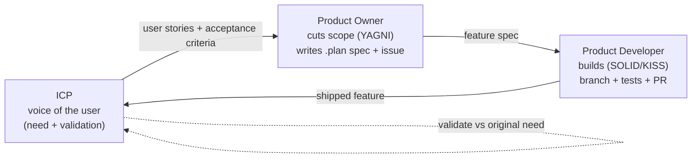

# coldsocial

**Automate your social media presence — as you, not as a bot.**

coldsocial gathers who you are (your goals, voice, interests, audience, and social accounts),
generates platform-native posts for **LinkedIn, TikTok, Instagram, YouTube, Facebook** and
beyond, publishes and schedules them, then watches how they perform (likes, comments, shares,
views, saves, reach) and feeds that back into the next round of content.

> Status: early development. The foundation (auth, UI kit, app shell) and the persona intake
> flow are in place; content generation and platform publishing are the features being built
> next through the workflow described below.

---

## Contents

- [Who it's for](#who-its-for)
- [Tech stack](#tech-stack)
- [Getting started](#getting-started)
- [Everyday commands](#everyday-commands)
- [Project structure](#project-structure)
- [How we build: the agent loop](#how-we-build-the-agent-loop)
- [Contributing](#contributing)
- [Working on an open issue (step by step)](#working-on-an-open-issue-step-by-step)
- [Coding standards](#coding-standards)
- [Engineering principles](#engineering-principles)
- [Security](#security)
- [License](#license)

---

## Who it's for

Three ideal customer profiles drive every decision (see
[`.github/agents/icp.md`](.github/agents/icp.md)):

- **Priya** — the solo entrepreneur / founder who needs to stay visible without writing content.
- **Marcus** — the executive building a credible thought-leadership brand, who needs approval
  before anything goes live.
- **Sofia** — the creator growing an audience across platforms who needs a steady cadence from
  one place.

If a change doesn't help one of them, it probably doesn't belong in the current slice.

## Tech stack

| Layer | Choice |
| --- | --- |
| Backend | Laravel 13 (PHP 8.3+) |
| Auth | Laravel Fortify (headless) |
| Frontend | Inertia.js v3 + React 19 + TypeScript (strict) |
| Styling | Tailwind CSS v4 + shadcn/ui (new-york) |
| Typed routes | Laravel Wayfinder (`@/routes`, `@/actions`) |
| Database | PostgreSQL 18 |
| Tests | Pest 5 (feature tests preferred) |
| Static analysis | PHPStan / Larastan, `tsc --noEmit` |
| Formatting / lint | Laravel Pint, Prettier, ESLint |
| Local services | Docker via Laravel Sail (Postgres, Valkey, Mailpit, MinIO, RabbitMQ) |

Conventions for each domain live in [`AGENTS.md`](AGENTS.md) and the skills under
[`.agents/skills/`](.agents/skills/). **Activate the matching skill before working in that
domain.**

## Getting started

### Prerequisites

- **PHP 8.3+** and **Composer**
- **Node.js 20+** and **npm**
- **Docker** (for PostgreSQL and the other local services)

### Recommended: native app + Dockerized Postgres

This matches the default `APP_URL` (`http://localhost:8000`) and the `composer run dev` flow.

```bash
# 1. Clone
git clone https://github.com/elitale/coldsocial.git
cd coldsocial

# 2. Environment
cp .env.example .env
# Running the app on your host? Point the DB at the forwarded port:
#   set DB_HOST=127.0.0.1 in .env   (the default `pgsql` only resolves inside Docker)

# 3. Start PostgreSQL (also auto-creates the `testing` database used by Pest)
docker compose up -d pgsql

# 4. Install dependencies & boot the app
composer install
php artisan key:generate
php artisan migrate
npm install

# 5. Run everything (Laravel server + queue + logs + Vite) with one command
composer run dev
```

The app is now at **http://localhost:8000**. Register a user and you'll land on the dashboard.

### Alternative: full Laravel Sail

Keep `DB_HOST=pgsql` (the default) and run everything inside Docker:

```bash
cp .env.example .env
composer install                 # needed to get the ./vendor/bin/sail binary
./vendor/bin/sail up -d          # tip: alias sail='./vendor/bin/sail'
sail artisan key:generate
sail artisan migrate
sail npm install
sail npm run dev
```

With Sail the app is served on **http://localhost** (set `APP_PORT=8000` in `.env` to match
`APP_URL`). Prefix the commands in the next section with `sail` when you use this path.

### Verify your setup

```bash
composer ci:check
```

This is the same gate CI runs. If it's green, you're ready to contribute.

## Everyday commands

| Task | Command |
| --- | --- |
| Run app (server + queue + logs + Vite) | `composer run dev` |
| Front-end dev server only | `npm run dev` |
| Build front-end assets | `npm run build` |
| Run the full CI gate locally | `composer ci:check` |
| Run tests | `php artisan test` (or `php artisan test --compact`) |
| Run one test file | `php artisan test --filter=PersonaUpdateTest` |
| Fix PHP formatting | `vendor/bin/pint` |
| Fix JS/TS formatting | `npm run format` |
| Fix lint issues | `npm run lint` |
| Static analysis (PHP) | `composer types:check` |
| Type-check (TS) | `npm run types:check` |
| Regenerate typed routes | `php artisan wayfinder:generate` |

> Tests run against a dedicated Postgres `testing` database (created automatically by the
> `pgsql` container). Use factories and `RefreshDatabase` — never touch dev data in a test.

## Project structure

```
app/
  Http/Controllers/     Thin controllers
  Http/Requests/        Form Request validation
  Models/               Eloquent models
resources/js/
  pages/                Inertia page components (Inertia::render targets)
  components/           React components (incl. components/ui = shadcn)
  layouts/              App & auth layouts
  routes/ actions/      Wayfinder-generated typed routes (do not edit by hand)
routes/web.php          Route definitions (named routes)
database/               migrations / factories / seeders
tests/                  Pest tests (Feature preferred, Unit)
.plan/                  Feature specs — one per feature (source of truth for scope)
.github/                Agent workflow: copilot-instructions.md, agent.md, memory.md, agents/
.agents/skills/         Domain skills (Laravel, Pest, Inertia+React, Tailwind, Wayfinder…)
AGENTS.md               Tech conventions you MUST follow
```

## How we build: the agent loop

We ship **one feature at a time** through a three-role loop. Each role is defined in
[`.github/agents/`](.github/agents/) and hands off to the next. Contributors (human or AI) step
into these roles.



The golden rule:

> **One feature = one plan = one branch = one PR = one issue.**
> No plan, no code.

Every feature is specified in [`.plan/<NNNN>-<slug>.md`](.plan/) **before** any code is
written (copy [`.plan/_template.md`](.plan/_template.md)), and the GitHub issue links back to
that plan. Read [`.github/agent.md`](.github/agent.md) for the full state machine and handoff
contracts.

## Contributing

Contributions are welcome. See **[CONTRIBUTING.md](CONTRIBUTING.md)** for the full guide; the
essentials follow. The workflow keeps scope tight and reviews fast.

1. **Find a need.** Pick an [open issue](https://github.com/elitale/coldsocial/issues), or
   propose a new one by describing the *user need* (persona + pain + outcome), not a solution —
   that lets a proper plan be written first.
2. **One feature at a time.** We ship serially. Avoid starting a second feature while one is in
   `Building` or `InReview`.
3. **Follow the conventions** in [`AGENTS.md`](AGENTS.md) and activate the relevant skill in
   [`.agents/skills/`](.agents/skills/) before you touch that domain.
4. **Prove it with Pest tests** and make sure `composer ci:check` is green **before** you push.
5. **Open a PR** against `main` that references the plan and closes the issue.

### What makes a change mergeable

- It satisfies **every acceptance criterion** in its `.plan/` spec (checked off in the PR).
- It's covered by passing **Pest tests** (`php artisan test`).
- `composer ci:check` is green (ESLint, Prettier, `tsc`, Pint, PHPStan, Pest).
- It adds **no speculative scope** (YAGNI) and **no single-consumer abstraction** (KISS).
- New platform work sits **behind an existing contract** — never a `switch` over platform names.
- Secrets go through config/env only; no tokens are logged; platform API responses are treated
  as untrusted input.

## Working on an open issue (step by step)

```bash
# 0. Read the issue AND the .plan/<NNNN>-<slug>.md it links.
#    The plan is the source of truth for scope and acceptance criteria.

# 1. Comment on the issue to claim it and avoid duplicate work.

# 2. Branch from an up-to-date main.
git switch main && git pull
git switch -c feature/<NNNN>-<slug>      # e.g. feature/0005-generate-linkedin-week

# 3. Build the SMALLEST slice that meets the acceptance criteria (TDD with Pest).
#    Activate the matching skill(s); reuse existing components before adding new ones.

# 4. Keep it green as you go.
composer ci:check

# 5. Format anything you changed.
vendor/bin/pint --dirty && npm run format && npm run lint

# 6. Commit and push.
git add -A
git commit -m "feat(<area>): <what changed>"
git push -u origin feature/<NNNN>-<slug>

# 7. Open a PR against main:
#    - Title references the feature.
#    - Body links the plan and includes:  Closes #<issue>
#    - Tick off each acceptance criterion from the plan.
```

Then request review. After CI is green and the review is approved, the PR is **squash-merged**,
the issue auto-closes, and the shipped feature goes back to the ICP for validation.

**Never** commit straight to `main`, and **never** open a PR without a passing local
`composer ci:check`.

### Good to know

- **No plan yet?** If the change isn't a trivial fix, open an issue describing the need first so
  a plan can be scoped. This prevents scope creep and wasted work.
- **Found a new need mid-build?** Don't grow the current plan — file it as a new issue. Each
  plan stays a single, shippable slice.
- **Stuck on setup?** The `pgsql` container creates both the `laravel` (dev) and `testing`
  databases automatically. If tests can't connect, confirm `docker compose ps` shows `pgsql`
  healthy and that `DB_HOST` matches how you run the app (`127.0.0.1` native, `pgsql` in Sail).

## Coding standards

Enforced by `composer ci:check`; fix locally before pushing.

- **PHP** — Pint (`vendor/bin/pint`), PHPStan/Larastan (`composer types:check`), PHP 8 typed
  properties, constructor promotion, explicit return types. See the PHP rules in
  [`AGENTS.md`](AGENTS.md).
- **TypeScript/React** — ESLint + Prettier, `tsc --noEmit`, strict types, function components,
  Inertia `useForm`/`<Form>`, typed routes from Wayfinder (no hardcoded URLs).
- **Tests** — Pest; feature tests preferred; use factories and `RefreshDatabase`. Create with
  `php artisan make:test --pest <Name>`.
- **Commits** — small and focused; conventional-style prefixes (`feat:`, `fix:`, `refactor:`,
  `test:`, `docs:`) are appreciated.

## Engineering principles

We apply **SOLID + YAGNI + KISS together**. When they conflict, the tie-break order is
**KISS → YAGNI → SOLID**: pick the simplest thing that works, don't build what no ICP has
asked for, and only introduce an interface/factory/event/config flag once a **second** concrete
consumer exists. Adding a new social platform should mean adding a class that implements the
existing publisher/metrics contract — not editing a `switch`. Full detail in
[`.github/copilot-instructions.md`](.github/copilot-instructions.md).

## Security

- Handle OAuth tokens and third-party credentials via config/env only — never hardcode, never
  log them. Treat every platform API response as untrusted input.
- Nothing is published on a user's behalf without their explicit approval.
- Found a vulnerability? **Do not open a public issue.** Report it privately to the maintainers
  via the repository's security advisories.

## License

Released under the **MIT License** — see [`LICENSE`](LICENSE).
